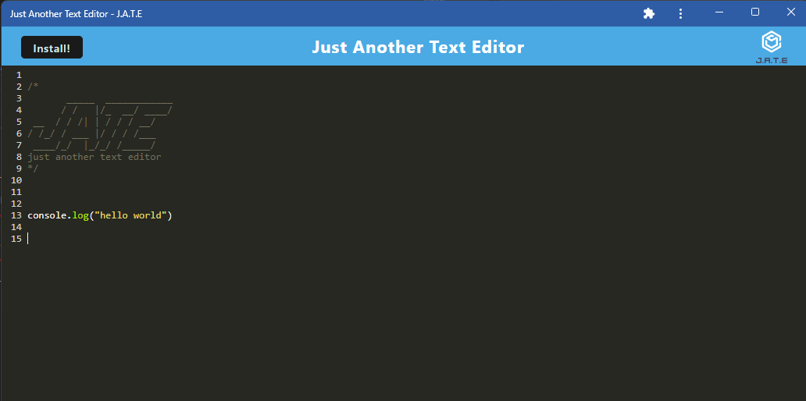

# Just Another Text Editor
The following is a text editor web application that utilizes PWAs so that it can be used even when the user has no internet connection. 

## Purpose of Assignment
 - The main purpose of this assignment was to demonstrate the proper use of PWAs for a given web application. 
 - This web application is a simple text editor that is set up to work online, but also can be downloaded locally onto user's computers and used without an internet connection. 
 - The web app will stil run offline, and all changes made in the app are saved to a local indexed database. 
 - When the internet connection is restored, all changes made in the app offline wil be updated from the indexed database and the online version will look just like the offline one. 

## Instructions for the User
 - Please use app and comment on any errors.

## Screen Shot of Working Application

## Link to GitHub Repository
[Click Here to View GitHub Repo](https://github.com/Aidan-Windebank/text-editor)

## Link to Deployed Web Application
[Click Here to Visit Web Application]()